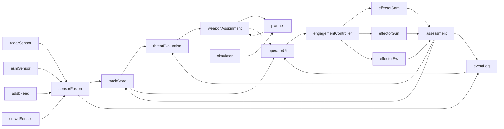

# Air Defense Command & Control — Research Note

> Practical reference for the Saab hackathon prototype: a decision-support / C2
> system for future air defense that helps an operator, in real time, allocate
> sensors and effectors against incoming threats and plan several steps ahead
> as resources deplete and new threats appear.

This document is a build-oriented synthesis of open sources. It is not a
doctrine essay. Every section closes with a "what this means for the
prototype" note where useful.

---

## 1. Terminology: C2, BMC2, IADS, and friends

Modern air-defense literature uses a dense acronym soup. These are the ones
the team will actually meet in the sources.

| Term | Meaning | Why it matters to us |
|------|---------|----------------------|
| **C2** | Command and Control — the exercise of authority and direction by a commander over assigned forces. | The umbrella concept. Our prototype is a C2 *aid*. |
| **C3 / C4 / C4ISR** | C2 + Communications (+ Computers) (+ Intelligence, Surveillance, Reconnaissance). | Reminds us that sensors and comms are part of the system, not external. |
| **BMC2** | Battle Management Command & Control — the *tactical*, time-sensitive layer of C2 that pairs sensors to shooters. | This is exactly the layer our hackathon prototype operates at. |
| **ABMS** | Advanced Battle Management System (US Air Force). A cloud-native "combat cloud" vision for joint BMC2. | Reference for architecture patterns (pub/sub, cloud, open data). |
| **IADS** | Integrated Air Defense System — the federation of sensors, effectors, and C2 nodes that defends an airspace. | Our prototype is a C2 node inside a conceptual IADS. |
| **AOC** | Air Operations Center — theater-level air planning and execution. | Above our level; we feed / receive tasking from it. |
| **CRC / ARS** | Control and Reporting Centre (legacy) / Air Control Centre, Recognized Air Picture Production Centre & Sensor Fusion Post (NATO ACCS). | Operational air-surveillance node. Good mental model of the user's role. |
| **SAOC** | Sector Air Operations Centre — operates a defended sector. | Another typical deployment target for a tool like ours. |
| **TEWA** | Threat Evaluation & Weapon Assignment. | The core algorithmic heart of the prototype. |
| **RAP / COP** | Recognized Air Picture / Common Operational Picture — the fused, agreed-upon view. | The *output* the operator consumes; a first-class concept in the UI. |
| **ROE** | Rules of Engagement. | Hard constraints the TEWA engine must respect (no engagement without satisfying ROE). |
| **IFF** | Identification Friend or Foe. | An input (track attribute), not a solved problem — unknowns are the interesting case. |

References:
[Wikipedia: Command and control](https://en.wikipedia.org/wiki/Command_and_control),
[Wikipedia: Integrated air defense system](https://en.wikipedia.org/wiki/Integrated_air_defense_system),
[Wikipedia: NATO Air Command and Control System](https://en.wikipedia.org/wiki/Air_Command_and_Control_System),
[IBCS overview (Northrop Grumman)](https://www.northropgrumman.com/what-we-do/missile-defense/integrated-battle-command-system-ibcs).

### 1.1 The OODA loop in an air-defense context

John Boyd's **Observe–Orient–Decide–Act** loop is the doctrinal skeleton for
any decision-support system. In air defense it maps cleanly onto the technical
pipeline:

| OODA stage | Air-defense realization |
|------------|-------------------------|
| Observe | Sensor feeds: radar returns, ESM, IRST, ADS-B, visual, acoustic. |
| Orient | Track formation, multi-sensor fusion, classification, IFF, threat evaluation. |
| Decide | Weapon–target pairing, engagement plan, ROE check, operator approval. |
| Act | Cue effector, fire, guide, hand-off. |
| (loop) | Kill assessment feeds back into Observe/Orient. |

The goal of a BMC2 aid is to *shrink the operator's OODA loop* and ideally get
**inside the adversary's** loop (act before they can react). See
[AFCEA: Decision Advantage Left of the Kill Chain](https://www.afcea.org/signal-media/cyber-edge/decision-advantage-left-kill-chain)
and
[Air University: Accelerating Decision-Making Through Human-Machine Teaming](https://www.airuniversity.af.edu/Wild-Blue-Yonder/Articles/Article-Display/Article/3816647/accelerating-decision-making-through-human-machine-teaming/).

### 1.2 Kill chain / kill web: F2T2EA

The US kill-chain model is **F2T2EA**:

1. **Find** — detect a candidate.
2. **Fix** — localize it accurately enough to act on.
3. **Track** — maintain continuous custody.
4. **Target** — choose an effector and engagement geometry.
5. **Engage** — fire / jam / hand off.
6. **Assess** — measure effect, decide on re-engagement.

A **kill web** is the modern generalization: instead of a linear chain tied to
one sensor-shooter pair, any sensor can cue any shooter through a shared data
fabric. IBCS's "any-sensor, best-shooter" slogan is exactly this. See
[Wikipedia: Kill chain (military)](https://en.wikipedia.org/wiki/Kill_chain_(military))
and
[The War Zone: how the Army will use IBCS](https://www.twz.com/sponsored-content/how-the-army-will-use-its-super-integrated-air-defense-system).

**What this means for the prototype:** model tracks and effectors as
*independent* first-class entities in a shared state, not as pre-wired pairs.
TEWA is then a matching problem over those two sets.

---

## 2. Core functions of an air-defense C2 system

A useful mental checklist when scoping the prototype:

- **Sensor management & cueing** — which sensor should look where, with what
  waveform / sector / revisit rate. Outputs: sensor tasking.
- **Track management & data fusion** — associate detections across sensors
  and time, maintain a single track per real object (multi-sensor, multi-source
  fusion, including non-kinetic sources like ADS-B, AIS, ESM). Saab's public
  material calls this a *Track Data Fusion Engine* in 9AIR C4I
  ([Saab: Automated C2 systems](https://www.saab.com/markets/thailand/editorial_articles/automated-c2-systems-enable-maximum-situational-awareness)).
- **Identification (ID) / IFF / ROE** — assign an affiliation (friend,
  hostile, neutral, unknown, assumed-friend, suspect) and check that
  engagement is legally permitted.
- **Threat Evaluation (TE)** — score how dangerous each track is to what we
  defend.
- **Weapon Assignment / Weapon–Target Assignment (WA / WTA)** — decide which
  effector engages which track, with how many rounds / interceptors, when.
- **Engagement monitoring & kill assessment** — watch the shot, detect
  success/failure, trigger shoot-look-shoot if needed.
- **Resource & inventory management** — interceptors remaining, gun barrels
  hot, launcher reload times, radar duty cycle, power, crew fatigue.
- **Coordination with adjacent units** — lateral C2: neighboring batteries,
  fighters on CAP, joint / allied units. Handoffs and airspace deconfliction.
- **Degraded / emission-controlled (EMCON) operation** — the system must keep
  working when a sensor is jammed, a link drops, or when we deliberately want
  to stay passive. This is a design constraint, not a feature — think
  graceful degradation.

See the state-of-the-art review
[Roux & van Vuuren: Threat evaluation and weapon assignment decision support](https://files01.core.ac.uk/download/pdf/37351098.pdf)
for a canonical taxonomy of these functions inside ground-based air defense.

---

## 3. TEWA — the heart of the challenge

TEWA is the algorithmic core of any BMC2 prototype. It is the part jurors
will poke at hardest.

### 3.1 What makes TEWA hard

- **Combinatorial.** With *n* threats and *m* effectors, assignments grow
  exponentially. The static WTA problem is NP-hard
  ([Intechopen: Survey on WTA](https://www.intechopen.com/chapters/75331)).
- **Stochastic.** Each shot has a probability of kill (Pk) and each sensor has
  a probability of detection. Good decisions are expectations, not certainties.
- **Dynamic.** Threats maneuver, new threats appear, effectors deplete,
  sensors get jammed. The problem is a moving target.
- **Multi-objective.** Maximize protected asset value, minimize interceptor
  expenditure, minimize collateral risk, respect ROE, keep reserve capacity.
- **Tight latency.** Saturation raids give the operator seconds. An "optimal"
  solver that takes 30 s is useless.
- **Explainable.** The operator has to trust and approve. A black-box answer
  that can't be justified is not deployable.

### 3.2 Algorithmic families

All of these appear in the public literature. They are complementary, not
competing — real systems stack them.

| Family | Typical use | Pros | Cons |
|--------|-------------|------|------|
| **Rule-based / expert systems** | ROE checks, hard constraints, "always engage ballistic before cruise". | Fully explainable, fast, auditable. | Brittle, hard to maintain. |
| **Heuristic scoring (e.g. threat index from speed, CPA, time-to-impact, asset value)** | First-cut threat ranking, Cambridge Pixel-style TEWA ([Cambridge Pixel TEWA](https://cambridgepixel.com/products/tracking-fusion-distribution/tewa/)). | Fast, transparent, tunable. | Not globally optimal. |
| **Greedy / threat-by-threat assignment** | Baseline WA. Assign the best available shooter to the most dangerous track first. | O(n·m), trivial to implement. | Myopic, wastes interceptors under saturation. |
| **Assignment problem / Hungarian algorithm** | One-to-one weapon-target matching with a cost matrix. | Polynomial time, optimal for the matrix given. | Doesn't handle one-to-many, salvos, or time. |
| **Integer / Mixed-Integer Programming (ILP / MILP)** | Full static WTA with constraints (ammo, time windows, salvo size). | Globally optimal. Solvers (CBC, HiGHS, OR-Tools) are mature. | Latency grows fast; tricky to warm-start. |
| **Auction / market-based** | Distributed WTA across multiple batteries without a central planner. | Scales, robust to node loss. | Non-optimal, needs good bidding rules. |
| **Stable Marriage Algorithm (many-to-many variant)** | Pairing threats with assets and effectors; used in e.g. Naeem et al. ([ScienceDirect](https://www.sciencedirect.com/science/article/abs/pii/S0950705109001543)). | Near-optimal, stable, fast. | Requires well-defined preference lists. |
| **Genetic algorithms / PSO / ALNS** | Large dynamic WTA, multi-stage. See [MDPI 2021](https://www.mdpi.com/2076-3417/11/19/9254), [Adaptive Large Neighborhood Search](https://www.sciencedirect.com/science/article/abs/pii/S0360835223003273). | Handle messy, non-convex objectives. | Tuning-heavy, non-deterministic. |
| **Fuzzy logic** | Threat evaluation when inputs are uncertain / linguistic ([TEWA with Fuzzy Logic](https://www.researchgate.net/publication/362826558_TEWA_Interface_with_Fuzzy_Logic)). | Handles vagueness; matches how operators talk. | Hard to validate rigorously. |
| **Markov Decision Process / Approximate Dynamic Programming** | Multi-stage planning, shoot-look-shoot. See [Summers et al. 2020](https://www.sciencedirect.com/science/article/abs/pii/S0305054820300071). | Principled for sequential decisions. | Curse of dimensionality. |
| **Monte Carlo Tree Search (MCTS) / rollouts** | "Think several steps ahead" under uncertainty; no exact model required. | Anytime: returns a good move as soon as budget runs out. Explainable via visited branches. | Needs a fast simulator. |
| **Reinforcement Learning (DQN, actor-critic)** | Learned policies for dynamic WTA ([Sun et al. 2024](https://www.sciencedirect.com/science/article/abs/pii/S0045790624003069), [AIAA 2025](https://arc.aiaa.org/doi/10.2514/6.2025-1546)). | Very fast at inference. | Training data / sim needed; explainability is weak. |

### 3.3 Static vs dynamic, single-stage vs multi-stage

- **Static WTA (SWTA):** one-shot assignment, all threats known, no feedback.
  Useful as a baseline and sanity check.
- **Dynamic WTA (DWTA):** assignments made across time stages, each stage
  informed by the previous one (hits, misses, new tracks). This is what real
  air defense does.
- **Shoot-Look-Shoot (SLS):** the canonical multi-stage tactic — fire,
  observe, re-engage if needed. Reserving a second shot is an explicit
  decision variable ([MIT DSpace: Dynamic WTA](https://dspace.mit.edu/bitstream/handle/1721.1/3063/P-1786-18693609.pdf)).

### 3.4 Trade-offs: optimality vs latency vs explainability

A practical TEWA engine balances three axes:

- **Optimality** — MILP and RL can get near the global optimum.
- **Latency** — heuristics, Hungarian, and trained RL policies run in
  milliseconds.
- **Explainability** — rule-based scoring and MCTS (show the tree) beat ILP
  and deep RL.

A common production pattern (and a good pattern for the hackathon):

1. **Fast path:** heuristic score + greedy assignment produces a recommendation
   in < 100 ms.
2. **Slow path:** a MILP or MCTS-based planner refines it over the next
   few seconds and pushes an updated recommendation.
3. **Operator UI** shows the current recommendation, the score breakdown, and
   flags whenever the slow path disagrees with the fast path.

### 3.5 "Thinking several steps ahead"

The jury wants to see look-ahead. The building blocks:

- **Simulator.** Forward-propagate tracks (kinematic models + intent), model
  shot outcomes as Bernoulli with known Pk, decrement inventory.
- **Search.** Either
  - **MCTS** over action sequences (assign / defer / re-task sensor), using
    the simulator for rollouts, OR
  - **Receding-horizon MILP** (solve now, re-solve every few seconds with
    updated state), OR
  - **Rollout policy** — simulate "greedy from here" N times, pick the action
    with best average outcome. Cheap and surprisingly effective.
- **Value function.** A score for a state: Σ (remaining protected-asset value)
  − (expected interceptor cost) − (risk of leakers).

MCTS is a strong pick for a hackathon because it is *anytime*, handles
uncertainty natively, and the tree itself is a free explainability artifact.

---

## 4. Real-world reference systems

Focused on what we can *steal* architecturally.

### 4.1 NATO ACCS

The NATO **Air Command and Control System** replaces national/legacy air
C2 with a common system across allied airspace. Hierarchy: **CAOC** (theater)
→ **ARS** (the modern CRC, doing air control + RAP production + sensor
fusion) → sensors and effectors. A deployable flavor (**DACCC / DARS**) exists.
Key lessons for us: *single fused RAP*, *modular sensor fusion post*,
*deployability* as a first-class concern.
[Wikipedia: ACCS](https://en.wikipedia.org/wiki/Air_Command_and_Control_System),
[NATO DACCC](https://ac.nato.int/about/daccc),
[ThalesRaytheon ACCS Addendum 3](https://www.thalesraytheon.com/psa-addendum-3-accs/).

### 4.2 US Link 16 / IBCS

**Link 16** is NATO's jam-resistant TDMA tactical data link (STANAG 5516) that
carries J-series messages between fighters, ships, AEW, and ground C2. It is
the *lingua franca* we would claim compatibility with.
[Wikipedia: Link 16](https://en.wikipedia.org/wiki/Link_16),
[Missile Defense Advocacy: Link 16](https://www.missiledefenseadvocacy.org/defense-systems/link-16/).

**IBCS** (Integrated Battle Command System, US Army, Northrop Grumman) is the
current reference for modern BMC2: "any-sensor, best-shooter", a Modular Open
Systems Approach, an Integrated Fire Control Network (IFCN) of self-healing
relay nodes, decoupled sensors/shooters, and Engagement Operations Centers.
Architectural takeaways:

- **Decouple** sensors and effectors via a data fabric; no bespoke pairs.
- **Open / modular** — define interfaces, let vendors plug in.
- **Unified air picture** produced once from all feeds.

[Northrop Grumman: IBCS](https://www.northropgrumman.com/what-we-do/missile-defense/integrated-battle-command-system-ibcs),
[Army.mil: IBCS and integrated fires](https://www.army.mil/article/290087/ibcs_and_the_future_of_offensive_and_defensive_integrated_fires),
[Wikipedia: IAMD BCS](https://en.wikipedia.org/wiki/Integrated_Air_and_Missile_Defense_Battle_Command_System).

### 4.3 Saab 9AIR C4I, 9LV CMS, GlobalEye, Combat Cloud

- **9AIR C4I** — Saab's modular, highly automated air C2 system. Its core
  is a **Track Data Fusion Engine (TDFE)** for multi-sensor tracking, with an
  AI-assisted **Multi-Sensor Optimiser (MSO)** to advise on sensor management.
  [Saab: Automated C2](https://www.saab.com/markets/thailand/editorial_articles/automated-c2-systems-enable-maximum-situational-awareness).
- **9LV CMS** — Saab's naval Combat Management System. Open, modular, fuses
  radar / ESM / EW / data links and runs TEWA for ship self-defense.
  [Saab: 9LV CMS](https://www.saab.com/products/9lv-cms),
  [Wikipedia: 9LV](https://en.wikipedia.org/wiki/9LV).
- **GlobalEye** — AEW&C platform with Erieye ER radar, acting as a flying
  fusion and C2 hub.
  [Defense Post: GlobalEye guide](https://thedefensepost.com/2025/12/05/globaleye-saab-guide/).
- **Combat Cloud** concept — shared battlespace data across platforms (Saab
  uses the term in its marketing and in studies of AI-assisted C2 adaptivity
  [Chalmers thesis: Visualizing AI-Supported Adaptivity](https://odr.chalmers.se/items/58de1e93-26a1-48af-b32b-5a8fada38e4f)).

Takeaways: a **named fusion engine** as an architectural component is a very
"Saab-flavored" way of presenting the system. Highlighting a named *decision*
engine next to it (our TEWA / planning module) lines up well.

### 4.4 Rheinmetall Skymaster / Oerlikon Skyshield

**Oerlikon Skymaster** is the battle-management brain of the Skynex short-range
air defense network. It does automated TEWA, integrates legacy Skyshield /
Skyguard fire units, and supports C-RAM and C-UAS. It explicitly emphasizes
a *plug-and-fight*, hierarchically cascadable architecture.
[Rheinmetall: Skymaster brochure (PDF)](https://www.rheinmetall.com/Rheinmetall%20Group/brochure-download/Air-Defence/D840e1124-Oerlikon-Skymaster-Command-and-Control-System.pdf),
[Rheinmetall: Skynex](https://www.rheinmetall.com/en/products/air-defence-systems/networked-air-defence-skynex),
[Wikipedia: Skyshield](https://en.wikipedia.org/wiki/Skyshield).

### 4.5 Ukraine — Delta, Kropyva, crowdsourced sensing

Public reporting on Ukraine's **Delta** situational-awareness system is the
best modern example of *lean, software-first, distributed* C2:

- Runs on commodity hardware (phones, tablets, laptops).
- Aggregates drones, radar, OSINT, and crowd reports into one map.
- Interoperates with Link 16 / NATO formats.
- Uses AI to accelerate the kill chain (target ID from video).
- Survives on Starlink and other non-traditional bearers.

Earlier/parallel efforts like **Zvook** (acoustic crowdsourced cruise-missile
sensing) and **Kropyva** (artillery fire control) show that low-cost,
distributed sensor nets combined with a common picture are a credible
alternative to monolithic IADS for specific tasks.

[CSIS: Ukraine CJADC2](https://www.csis.org/analysis/does-ukraine-already-have-functional-cjadc2-technology),
[CEPA: Ukraine's Key Battlefield System](https://cepa.org/article/the-heart-of-war-ukraines-key-battlefield-system/),
[Janes: Delta as sole data source](https://www.janes.com/osint-insights/defence-news/c4isr/ukraines-delta-system-to-become-only-source-for-data-transfers-across-afu),
[Grey Dynamics: Delta / network-centric warfare](https://greydynamics.com/network-centric-warfare-in-ukraine-the-delta-system/).

**Inspiration for us:** don't build a monument. Build a small, fast tool on
commodity tech that could realistically be fielded in weeks.

---

## 5. Data standards and interoperability

A prototype won't implement these, but should be aware of them and claim
compatibility at the data-model level.

- **Link 16 (STANAG 5516) / MIDS terminals / J-series messages** — the
  backbone tactical data link. J-series messages cover surveillance (J3.x),
  weapons coordination (J10.x), electronic warfare (J13.x), and more.
  [Wikipedia: Link 16](https://en.wikipedia.org/wiki/Link_16),
  [Wikipedia: Tactical data link](https://en.wikipedia.org/wiki/Tactical_data_link).
- **Link 11 (STANAG 5511)**, **Link 22 (STANAG 5522)** — legacy and modern
  naval TDLs; Link 22 carries J-series and interoperates with Link 16.
- **JREAP (STANAG 5518)** — Joint Range Extension Applications Protocol;
  carries J-series over IP / long-haul, including satellite. This is the
  one a software-centric prototype can plausibly emulate.
- **SIMPLE (STANAG 5602)** — J-series over IP for simulation/test.
- **NFFI (NATO Friendly Force Information, STANAG 5527)** — blue-force
  tracking.
- **ADatP-3** — the classic NATO message text format (character-oriented
  messages like AIRTASKORD). Useful to namecheck for "joint tasking".
- **OTH-Gold / OTH-T Gold** — older US over-the-horizon track format; still
  referenced.

**Why this matters for our input format choice:** we want a JSON data model
whose *fields* map 1:1 to Link-16 track concepts (track number, position,
velocity, identity, strength, threat posture, emitter type). Then "Link 16
compatible" is a believable claim in the demo, and the model is immediately
intelligible to anyone who has seen a tactical display.

---

## 6. Operator UX — what a good C2 screen looks like

### 6.1 Standard views

Real C2 consoles (ACCS, IBCS EOC, 9LV, Skymaster) all converge on roughly the
same panel set:

- **Geographic map** with the RAP: all tracks, defended assets, effector
  positions, sensor coverage rings, weapon engagement zones (WEZ),
  restricted/controlled airspace.
- **Track list / threat queue** — sortable by priority, time-to-impact, ID
  status, assigned weapon.
- **Engagement list** — current engagements, phase (pre-launch, in-flight,
  terminal, assessed), launcher, target.
- **Resource / inventory panel** — interceptors per launcher, barrels hot,
  radar load, comms health.
- **Timeline / Gantt** — past engagements, active ones, forecast impacts and
  weapon availability windows.
- **Alerts / notifications** — ROE violations, low inventory, missed
  engagement windows, sensor dropouts.
- **"Why?" / explanation panel** — for the currently selected recommendation,
  the factors that produced it.

### 6.2 Symbology: APP-6 / MIL-STD-2525

NATO APP-6 and US MIL-STD-2525 are harmonized military symbology standards.
Symbols are composed of:

- **Frame shape** — encodes *battle dimension* and *standard identity*.
- **Icon inside frame** — type of entity (aircraft, missile, launcher, radar).
- **Modifiers / amplifiers** — speed, altitude, strength, track number,
  engagement status.

For tracks, the **affiliation** (standard identity) determines the color and
the frame shape:

| Affiliation | Color | Frame shape |
|-------------|-------|-------------|
| Friend | Blue (cyan) | Rectangle |
| Assumed Friend | Blue | Rectangle (dashed) |
| Neutral | Green | Square |
| Unknown | Yellow | Quatrefoil ("cloud") |
| Pending | Yellow | Dashed quatrefoil |
| Suspect | Red | Diamond (dashed) |
| Hostile | Red | Diamond |

A **Symbol Identification Code (SIDC)** is the textual encoding (15 chars in
2525B/C, 20 digits in 2525D / APP-6(D)). For a prototype, **color + shape per
affiliation** is enough to feel authentic; operators will immediately read a
red diamond as "hostile".

[Wikipedia: NATO Joint Military Symbology](https://en.wikipedia.org/wiki/NATO_Joint_Military_Symbology),
[MIL-STD-2525C (NASA WorldWind mirror, PDF)](https://worldwind.arc.nasa.gov/milstd2525c/Mil-STD-2525C.pdf),
[FreeTAKServer: MIL-STD-2525 / CoT notes](https://freetakteam.github.io/FreeTAKServer-User-Docs/About/architecture/mil_std_2525/).

### 6.3 Alerting, prioritization, and information overload

Operators are the bottleneck, not the CPU. Design rules that appear across
the literature and Saab's own UX research
([Chalmers thesis on AI-supported adaptivity](https://odr.chalmers.se/items/58de1e93-26a1-48af-b32b-5a8fada38e4f)):

- **Highlight by prioritized threat**, not by the order the system happened
  to detect. Re-rank continuously.
- **De-clutter** — collapse routine friendly traffic, expand only on hover or
  on anomaly.
- **One pre-attentive channel per critical cue** — color for affiliation,
  shape for domain, size/pulse for priority. Don't overload a channel.
- **Audible cues** for "new highest-priority threat" and "engagement
  authorization needed" only — anything more and the operator mutes audio.
- **Persistent recommendation bar** at the bottom/top of the screen showing
  the *single* next recommended action plus a one-line "why".

### 6.4 Human-in-the-loop vs human-on-the-loop

Taxonomy from [Air University](https://www.airuniversity.af.edu/Wild-Blue-Yonder/Articles/Article-Display/Article/3816647/accelerating-decision-making-through-human-machine-teaming/),
[JAPCC](https://www.japcc.org/essays/human-on-the-loop/),
[War on the Rocks](https://warontherocks.com/2025/05/autonomous-weapon-systems-no-human-in-the-loop-required-and-other-myths-dispelled/):

- **Human-in-the-loop (HITL)** — every engagement needs explicit human
  approval. Safe, slow. Appropriate for air-to-air BVR, high-collateral-risk
  areas, ambiguous IDs.
- **Human-on-the-loop (HOTL)** — system engages autonomously within
  pre-authorized constraints; human can veto. Appropriate for *terminal*
  self-defense (C-RAM, close-in saturation raids) where human reaction time
  is simply too slow.
- **Human-out-of-the-loop** — pure autonomy. Hard NATO/DoD policy
  constraints apply; generally reserved for kinetic-kinetic defense against
  non-human threats (incoming rockets/mortars).

**Design rule for the prototype:** make the authority level per engagement an
explicit, *visible* mode. Default to HITL. Let the commander pre-authorize
HOTL for specific threat classes and areas.

### 6.5 Explainability is non-negotiable

Operators (and jurors) must understand **why** the system recommends a given
engagement. Minimum viable explanation for each recommendation:

- Threat score breakdown: time-to-impact, CPA to defended asset, asset value,
  classification confidence.
- Effector choice: Pk for this geometry, inventory remaining, engagement
  window, ROE status.
- Alternative considered and rejected, with one-line reasons.

The MCTS tree, a sorted score table, or a short templated sentence are all
fine implementations. The point is: **no silent recommendations**.

---

## 7. Architecture patterns for a modern C2 prototype

### 7.1 Event-driven pub/sub backbone

Sensors, fusion, TEWA, UI, and a simulator are naturally decoupled producers
and consumers. An event bus (NATS, Redis Streams, Kafka, or even
Server-Sent Events / WebSockets for a hackathon) gives us:

- Easy to add a new sensor or a new UI panel.
- Natural log / replay: the event stream *is* the audit trail.
- Cleanly matches IBCS's "plug-and-fight" narrative.

### 7.2 Track store vs event log

Two complementary storage patterns:

- **Event log** — append-only stream of detections, updates, commands,
  assessments. Source of truth. Replayable.
- **Track store** — current materialized view: one row per track with
  latest state. Fast to query for the map and the TEWA engine.

This is just classic CQRS / event sourcing. It also makes "what-if" trivial:
fork the event stream, run an alternative world, diff the outcomes.

### 7.3 Simulation engine alongside the decision engine

Treat the **simulator as a first-class module**, not just a testing tool:

- TEWA uses it to roll out candidate actions (MCTS, receding-horizon).
- The UI uses it for "what-if I hold fire on track 12?".
- The demo uses it as a threat generator.

One engine, three consumers, one code path. High payoff per line of code.

### 7.4 Where AI / LLMs help — and where they must not

**Good AI-assisted roles** (low risk, high operator value):

- **Natural-language queries** on the RAP ("any unknowns closing on
  Asset-Alpha in the next 2 minutes?").
- **Explanation generation** — templated or LLM-summarized rationales for a
  recommendation.
- **Anomaly narration** — "track 47's kinematics just changed from airliner
  to fighter profile".
- **After-action summaries** and briefings.
- **Sensor-tasking suggestions** — "we haven't illuminated sector 3 in 40s".

**Keep LLMs out of**:

- Actual fire authorization.
- The tight TEWA loop (latency, determinism, auditability).
- Any decision that is not trivially reversible or not checked by a
  deterministic policy layer.

This is aligned with DoD 3000.09's "appropriate levels of human judgment"
framing — the human (not the LLM) is the accountable decision-maker.

### 7.5 Logging and auditability

Everything that produces or changes a track, a recommendation, or an
engagement gets an immutable log entry with:

- timestamp (monotonic + wall-clock),
- source (sensor ID, module name),
- input hash,
- output / decision,
- reasoning payload (score vector, rule IDs fired, MCTS-visit counts).

This is what turns a hackathon demo into something a real defense jury takes
seriously.

---

## 8. End-to-end data flow (mermaid)



The feedback arrows from `assessment` back into `trackStore` and
`threatEvaluation` are the core of "shoot-look-shoot" and of closing the OODA
loop.

---

## 9. Concrete recommendations for the hackathon prototype

### 9.1 Minimum viable architecture

Keep it boring and fast:

- **Threat generator** — scripted + randomized: waves of cruise missiles,
  drones, aircraft, with maneuver profiles.
- **Track store** — in-memory (dict) + append-only JSONL event log.
- **TEWA engine** — two-stage:
  1. Heuristic threat score (time-to-impact, CPA, asset value, class weight)
     + greedy assignment — always available, < 100 ms.
  2. MCTS / receding-horizon refinement — runs on a budget, produces an
     alternative plan the UI can "prefer" when better.
- **Simulator** — forward-kinematic propagation + Bernoulli shot model,
  shared between TEWA planner and UI what-if.
- **Backend** — FastAPI (Python) or Node/TypeScript. Python wins if the team
  wants to plug in OR-Tools / scipy / a small RL policy.
- **Message bus** — WebSockets or Server-Sent Events is enough. NATS if the
  team is comfortable.
- **Frontend** — React + **deck.gl** on top of **MapLibre GL JS** for the
  tactical map ([deck.gl + MapLibre integration](https://deck.gl/docs/developer-guide/base-maps/using-with-maplibre)).
  Cesium if 3D / globe view matters for the demo.
- **Symbology** — MIL-STD-2525-flavored icons (color + shape per affiliation
  is enough); any open SVG pack works.

### 9.2 Suggested tech stack

| Layer | Primary pick | Alternatives |
|-------|--------------|--------------|
| Map base | MapLibre GL JS | Leaflet, Cesium (for 3D) |
| Track rendering | deck.gl (IconLayer, PathLayer, ArcLayer) | Leaflet layers, Pixi |
| Frontend framework | React + TypeScript + Vite | SvelteKit |
| Realtime transport | WebSocket (native or Socket.io) | Server-Sent Events, NATS |
| Backend | Python FastAPI | Node/TS Fastify, Go |
| Optimization | OR-Tools (assignment, CP-SAT), scipy.optimize | HiGHS, PuLP |
| ML / RL (optional) | PyTorch + stable-baselines3 | JAX + Flax |
| Event log | JSONL on disk | SQLite, DuckDB |
| Auth / audit (nice to have) | signed JWTs + append-only log | — |

### 9.3 Minimal data model (pseudo-schema)

```json
// Track: one fused object in the air picture
{
  "trackId": "TRK-0001",
  "updatedAt": "2026-04-18T10:15:03.214Z",
  "position": { "lat": 58.41, "lon": 15.62, "altM": 1200 },
  "velocity": { "speedMps": 240, "headingDeg": 95, "climbMps": 0 },
  "covariance": [[100,0,0],[0,100,0],[0,0,25]],
  "affiliation": "hostile | suspect | unknown | pending | neutral | assumedFriend | friend",
  "classification": { "type": "cruiseMissile", "confidence": 0.78 },
  "emitters": ["search-X", "fc-Ku"],
  "sources": ["radar-A", "esm-1"],
  "sidc": "SHAPMFA----*****"
}

// Effector: something that can act on a track
{
  "effectorId": "SAM-N1",
  "kind": "sam | gun | ew | dew",
  "position": { "lat": 58.40, "lon": 15.60 },
  "weaponEngagementZone": { "minRangeM": 2000, "maxRangeM": 40000,
                            "minAltM": 15, "maxAltM": 10000 },
  "inventory": [{ "munition": "interceptor-A", "count": 8 }],
  "readyInS": 0,
  "reloadS": 4,
  "pkModel": "pk(track, geometry) -> [0,1]"
}

// Engagement: an instance of action on a (track, effector) pair
{
  "engagementId": "ENG-0007",
  "trackId": "TRK-0001",
  "effectorId": "SAM-N1",
  "state": "proposed | authorized | inFlight | assessed",
  "plannedAtoS": 12.4,
  "salvo": 1,
  "expectedPk": 0.83,
  "authorizedBy": "operator-01",
  "rationale": {
    "threatScore": 0.91,
    "factors": { "tti": 0.7, "cpa": 0.9, "assetValue": 0.8, "class": 0.9 },
    "alternatives": [
      { "effectorId": "GUN-W2", "reasonRejected": "out-of-WEZ" }
    ]
  }
}

// Assignment plan: the TEWA engine's output for the current stage
{
  "planId": "PLAN-0042",
  "horizonS": 60,
  "generatedAt": "2026-04-18T10:15:03.600Z",
  "assignments": [
    { "engagementId": "ENG-0007", "stage": 0, "confidence": 0.83 }
  ],
  "reserve": [{ "effectorId": "SAM-N2", "reservedFor": "futureWave" }],
  "algorithm": "heuristicGreedy | milp | mcts"
}
```

### 9.4 What to demo for maximum jury impact

Jurors care about: *"does this help users succeed much better at something
mission-critical?"* — translate to: **before/after a scripted saturation
raid**.

Suggested demo arc (roughly 4–5 minutes):

1. **Cold scene.** Map, defended assets, two batteries, quiet air picture.
2. **First wave** (3–4 threats). Operator handles manually. Show a timer /
   workload meter. One leaker gets through. This is the "without us"
   baseline — show it even if only for 20 seconds.
3. **Turn on the decision support.** Same scenario replays from the event
   log with TEWA engaged. System highlights the top threat, shows a
   one-sentence rationale, and pre-stages the assignment. Operator
   one-clicks *Authorize* per engagement.
4. **Saturation wave** (10+ simultaneous threats). Flip to HOTL mode for a
   pre-authorized threat class. Show the operator overriding one
   recommendation — prove the human remains in charge.
5. **"Think ahead."** Pop the MCTS/simulator view: "if you hold SAM-N2 in
   reserve, expected leakers in the next 60 s drop from 1.4 to 0.3". The
   operator accepts the plan.
6. **Degrade.** Kill a radar. Show the RAP gracefully degrade (wider
   covariance ellipses, coverage gap on map), watch TEWA re-task the
   remaining sensor and re-score threats.
7. **After-action.** Replay the event log and show an auto-generated
   summary (LLM-assisted is fine, clearly labeled "assisted"). Highlight
   log integrity for accountability.

The story to sell is: **"the operator stayed ahead of the OODA loop even
under saturation and degraded sensing, because the tool pre-thought the next
move and explained itself"**. That is exactly the challenge statement.

---

## 10. References

Core concepts:

- [Wikipedia: Command and control](https://en.wikipedia.org/wiki/Command_and_control)
- [Wikipedia: Integrated air defense system](https://en.wikipedia.org/wiki/Integrated_air_defense_system)
- [Wikipedia: Kill chain (military)](https://en.wikipedia.org/wiki/Kill_chain_(military))
- [AFCEA: The Decision Advantage — Left of the Kill Chain](https://www.afcea.org/signal-media/cyber-edge/decision-advantage-left-kill-chain)
- [Air University: Accelerating Decision-Making Through Human-Machine Teaming](https://www.airuniversity.af.edu/Wild-Blue-Yonder/Articles/Article-Display/Article/3816647/accelerating-decision-making-through-human-machine-teaming/)
- [JAPCC: Human-On-the-Loop](https://www.japcc.org/essays/human-on-the-loop/)
- [War on the Rocks: Autonomous Weapon Systems — No Human-in-the-Loop Required](https://warontherocks.com/2025/05/autonomous-weapon-systems-no-human-in-the-loop-required-and-other-myths-dispelled/)
- [US Air Force Academy IFC: Please Stop Saying 'Human-In-The-Loop'](https://ifc.usafa.edu/articles/please-stop-saying-human-in-the-loop)
- [NPS: Mapping AI to the Naval Tactical Kill Chain (PDF)](https://nps.edu/documents/10180/142489929/NEJ+Hybrid+Force+Issue_Mapping+AI+to+The+Naval+Kill+Chain.pdf)

Reference systems:

- [Wikipedia: NATO Air Command and Control System (ACCS)](https://en.wikipedia.org/wiki/Air_Command_and_Control_System)
- [NATO Allied Air Command: DACCC](https://ac.nato.int/about/daccc)
- [ThalesRaytheon: ACCS Addendum 3](https://www.thalesraytheon.com/psa-addendum-3-accs/)
- [Northrop Grumman: IBCS](https://www.northropgrumman.com/what-we-do/missile-defense/integrated-battle-command-system-ibcs)
- [Army.mil: IBCS and the Future of Integrated Fires](https://www.army.mil/article/290087/ibcs_and_the_future_of_offensive_and_defensive_integrated_fires)
- [The War Zone: How the Army will use IBCS](https://www.twz.com/sponsored-content/how-the-army-will-use-its-super-integrated-air-defense-system)
- [Wikipedia: IAMD Battle Command System](https://en.wikipedia.org/wiki/Integrated_Air_and_Missile_Defense_Battle_Command_System)
- [Saab: 9LV CMS](https://www.saab.com/products/9lv-cms)
- [Saab: 9LV Combat System](https://www.saab.com/products/9lv-cs)
- [Saab: Automated C2 systems (9AIR C4I, TDFE)](https://www.saab.com/markets/thailand/editorial_articles/automated-c2-systems-enable-maximum-situational-awareness)
- [Wikipedia: 9LV](https://en.wikipedia.org/wiki/9LV)
- [The Defense Post: Saab GlobalEye guide](https://thedefensepost.com/2025/12/05/globaleye-saab-guide/)
- [Chalmers thesis: Visualizing AI-Supported Adaptivity in C2 Interfaces](https://odr.chalmers.se/items/58de1e93-26a1-48af-b32b-5a8fada38e4f)
- [Rheinmetall: Oerlikon Skymaster C2 brochure (PDF)](https://www.rheinmetall.com/Rheinmetall%20Group/brochure-download/Air-Defence/D840e1124-Oerlikon-Skymaster-Command-and-Control-System.pdf)
- [Rheinmetall: Skynex networked air defence](https://www.rheinmetall.com/en/products/air-defence-systems/networked-air-defence-skynex)
- [Wikipedia: Skyshield](https://en.wikipedia.org/wiki/Skyshield)

Ukraine / lean distributed C2:

- [CSIS: Does Ukraine Already Have Functional CJADC2 Technology?](https://www.csis.org/analysis/does-ukraine-already-have-functional-cjadc2-technology)
- [CEPA: The Heart of War — Ukraine's Key Drone Battlefield System](https://cepa.org/article/the-heart-of-war-ukraines-key-battlefield-system/)
- [Janes: Delta to become Ukraine's sole data transfer source](https://www.janes.com/osint-insights/defence-news/c4isr/ukraines-delta-system-to-become-only-source-for-data-transfers-across-afu)
- [Grey Dynamics: Network-centric Warfare in Ukraine — The Delta System](https://greydynamics.com/network-centric-warfare-in-ukraine-the-delta-system/)
- [The Sixteenth Council: The Delta System — Future of European Defence?](https://16thcouncil.uk/the-delta-system-the-future-of-european-defence/)

Data standards / interoperability:

- [Wikipedia: Link 16](https://en.wikipedia.org/wiki/Link_16)
- [Wikipedia: Tactical data link](https://en.wikipedia.org/wiki/Tactical_data_link)
- [NISP: NATO STANAG 5516 (Link 16)](https://nisp.nw3.dk/standard/nato-stanag5516ed4.html)
- [Missile Defense Advocacy: Link 16](https://www.missiledefenseadvocacy.org/defense-systems/link-16/)
- [Isode: Tactical Data Links — Potential Communication Enhancements](https://www.isode.com/whitepaper/tactical-data-links-potential-communication-enhancements/)

Symbology and UX:

- [Wikipedia: NATO Joint Military Symbology (APP-6)](https://en.wikipedia.org/wiki/NATO_Joint_Military_Symbology)
- [MIL-STD-2525C (NASA WorldWind mirror, PDF)](https://worldwind.arc.nasa.gov/milstd2525c/Mil-STD-2525C.pdf)
- [FreeTAKServer: MIL-STD-2525 and CoT](https://freetakteam.github.io/FreeTAKServer-User-Docs/About/architecture/mil_std_2525/)
- [APP-6(C) NATO Joint Military Symbology (PDF)](https://guallah.com/archive/archive_files/archive_upload_9.pdf)

TEWA — algorithms and surveys:

- [Roux & van Vuuren: Threat evaluation and weapon assignment decision support (PDF)](https://files01.core.ac.uk/download/pdf/37351098.pdf)
- [Naeem et al.: Optimal dynamic TEWA with stable-marriage algorithm (ScienceDirect)](https://www.sciencedirect.com/science/article/abs/pii/S0950705109001543)
- [Naeem et al.: A Novel Two-Staged Decision Support Based TEWA (arXiv)](https://arxiv.org/pdf/0906.5038)
- [Intechopen: A Survey on Weapon Target Allocation Models and Applications](https://www.intechopen.com/chapters/75331)
- [DIVA: Evaluating the Performance of TEWA Systems (PDF)](https://www.diva-portal.org/smash/get/diva2:354687/FULLTEXT02.pdf)
- [Cambridge Pixel: TEWA software](https://cambridgepixel.com/products/tracking-fusion-distribution/tewa/)
- [DST Group: Evidential Network for Threat Evaluation (PDF)](https://www.dst.defence.gov.au/sites/default/files/publications/documents/DST-Group-TR-3349.pdf)
- [ResearchGate: TEWA Interface with Fuzzy Logic](https://www.researchgate.net/publication/362826558_TEWA_Interface_with_Fuzzy_Logic)

Multi-stage / dynamic WTA:

- [Summers et al.: ADP for Firing Policies in Networked Air Defense (ScienceDirect)](https://www.sciencedirect.com/science/article/abs/pii/S0305054820300071)
- [MIT DSpace: Dynamic Weapon-Target Assignment Problems (PDF)](https://dspace.mit.edu/bitstream/handle/1721.1/3063/P-1786-18693609.pdf)
- [MDPI: DWTA via Improved Multiobjective PSO](https://www.mdpi.com/2076-3417/11/19/9254)
- [ScienceDirect: Adaptive Large Neighborhood Search for Multi-Stage WTA](https://www.sciencedirect.com/science/article/abs/pii/S0360835223003273)
- [Sun et al.: Multistage WTA with Deep Q-learning + ABC](https://www.sciencedirect.com/science/article/abs/pii/S0045790624003069)
- [AIAA SciTech 2025: RL-based Cooperative Dynamic WTA](https://arc.aiaa.org/doi/10.2514/6.2025-1546)
- [Springer: WTA Decision Based on Markov Decision Process](https://link.springer.com/chapter/10.1007/978-3-642-34396-4_43)
- [DTIC: Application of Dynamic Programming for Weapon Assignment (PDF)](https://apps.dtic.mil/sti/tr/pdf/AD1004145.pdf)

Mapping / frontend:

- [deck.gl: Using with MapLibre](https://deck.gl/docs/developer-guide/base-maps/using-with-maplibre)
- [MapLibre GL JS](https://maplibre.org/maplibre-gl-js/docs/)
- [Cesium: TacMap blog](https://cesium.com/blog/2015/08/21/tacmap/)
- [mil-oss/TacMap on GitHub](https://github.com/mil-oss/TacMap)
