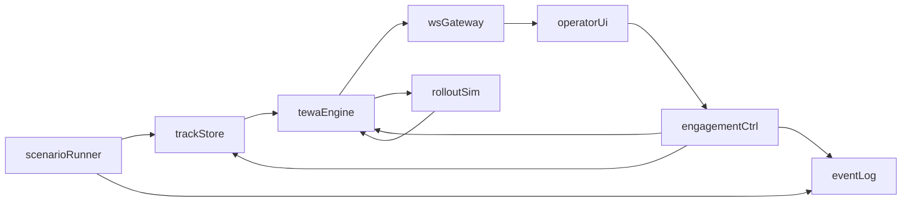

# Hackathon Idea — Opinionated Pick

> One-line pitch: **an explainable, cost-aware weapon–target pairing
> recommender for a Swedish Baltic-coast air-defense cell under a mixed
> saturation raid — with a "think-ahead" panel that shows what happens if
> the operator waits.**

This document picks **one narrow slice** of the full challenge and explains
why it is the slice most likely to win the Saab jury. Everything here is
derived from [threats-and-effectors.md](threats-and-effectors.md) and
[command-and-control.md](command-and-control.md).

---

## 1. The pick: "Smart TEWA — Layered, Cost-Aware, Explainable"

We build **the operator's decision panel for Weapon–Target Pairing**, plus
just enough world around it to make the panel come alive. The panel:

1. Shows the fused air picture on a map (tracks with MIL-STD-2525 symbology).
2. For each hostile track, computes the **top 3 engagement options** across
   all available fire units, scored on:
   - probability of kill (Pk),
   - cost-exchange (effector $ vs. threat $ vs. defended-asset value),
   - time-to-intercept vs. time-to-impact (feasibility),
   - magazine depletion and layered-defense logic (outer → inner).
3. Renders a **one-line rationale** next to the top recommendation and an
   expandable breakdown on click.
4. Has a **"think-ahead" toggle**: runs a short rollout of the next N
   seconds and shows how leakers / reserve-ammo would change if the
   operator **holds fire**, **engages now**, or **engages with a different
   effector**.
5. Supports **HITL authorize / override** for every engagement, and
   **HOTL auto-engage** only for a pre-authorized threat class (drones
   in a close-in belt).

That is the whole demo surface. Everything else (threat generator, tiny
simulator, event log, simple fusion) exists to feed this panel.

### The scenario (fixed, scripted)

A Swedish Baltic-coast defense cell, late afternoon, EMCON amber. Assets:

- 1× **GlobalEye** orbiting at 9 km (outer detection horizon).
- 1× **Giraffe 4A** ground radar near the coast.
- 1× **IRIS-T SLM** battery (E2 MR-SAM, 8 ready missiles).
- 1× **RBS 70 NG** platoon with 2 firing posts (E4 VSHORAD, 4+4 Bolide).
- 1× **Gepard-style C-RAM** at a nearby base (E5 AAA).
- 1× **Gripen E pair** on CAP with 4× Meteor + 2× IRIS-T each (E6/E7).

Defended: one airbase, one port, one city block — each with a different
value in the cost model.

The raid (three waves, ~90 seconds between):

- **Wave 1:** 2× subsonic cruise missiles (T5) sea-skimming from the east,
  plus 4× Shahed-class loitering munitions (T12) trailing behind.
- **Wave 2:** 10× Shahed-class saturation on the port (T13 feel).
- **Wave 3:** 1× pair of Su-class fighters (T1) at standoff launching 2×
  glide bombs (T14) at the airbase; 1× quasi-ballistic Iskander-class
  (T7) aimed at the city block — only to show the system *refuses* to
  engage it with the available inventory and explains why.

Every threat class in the scenario maps to a non-trivial decision in the
suitability matrix from the threats-and-effectors note. That is what makes
the demo land.

---

## 2. Why this slice (map to jury criteria)

The jury's two questions are:

1. Does the solution help users succeed better at something **very
   mission-critical**?
2. Does it **really** help them succeed **much** better?

This slice answers both because:

- **Mission-critical:** weapon–target pairing under saturation is exactly
  the problem Saab stated in the kickoff — "which effector is right, from
  which base, how do we keep capability as resources deplete." We are
  demoing that specific sentence.
- **Much better:** we can stage a **before/after** inside the demo. First
  minute: operator handles Wave 1 manually with a plain track list — one
  leaker. Second minute: decision support on — same wave replayed from the
  event log, one-click authorize, zero leakers, reserve intact for Wave 2.
  That comparison is visceral and unambiguous.
- **Multiple steps ahead:** the "think-ahead" panel turns an abstract
  claim ("the system plans ahead") into a concrete, visible artifact —
  the operator sees *why* holding SAM for Wave 2 is the right call.
- **Explainability:** every recommendation has a rationale. Saab and any
  defense jury will be actively hostile to a black box; we beat that by
  design.

The Ukraine Delta + lean-distributed-C2 narrative (from
[command-and-control.md §4.5](command-and-control.md)) also means the
prototype looks deployable, not like a PowerPoint.

---

## 3. In scope vs. out of scope (hard lines)

### In scope

- Single operator view. No multi-user sync.
- 2D map (MapLibre + deck.gl). No 3D.
- ~20 threats max on screen at once. Scripted waves, light randomization.
- ~6 fire units, ~3 sensors.
- Heuristic-scored greedy TEWA as the primary path.
- One "think-ahead" method — **Monte Carlo rollout of greedy policy** (see
  below). No MILP, no RL training.
- One data model, JSON-over-WebSocket. Fields intentionally look like
  Link-16 J-series track messages so we can claim interoperability.
- Audit log: append-only JSONL.

### Out of scope

- Real radar models, real Pk physics, real ballistics. All orders of
  magnitude, clearly labeled "simulated."
- Sensor fusion across many sources. We pretend fusion happened upstream
  and just hand the UI already-fused tracks.
- Multi-battery deconfliction beyond a single mutual-exclusion check.
- 3D airspace / terrain masking.
- A full APP-6 / MIL-STD-2525 symbology library. Color + shape per
  affiliation is enough (see
  [command-and-control.md §6.2](command-and-control.md)).
- LLM-anything in the engagement loop. An LLM may *narrate* after-action
  summary and answer natural-language questions about the RAP, clearly
  badged "AI-assisted, not in the engagement loop" — and only if we have
  time. Default: skip.

---

## 4. The TEWA logic, concretely

The recommender runs every 500 ms (or on any state change) with this
pipeline, per hostile track:

### 4.1 Threat score (0..1)

```
threatScore =
    0.35 * normalized(1 / timeToImpact)
  + 0.25 * classWeight[classId]              // ballistic > HGV > CM > UAV > drone
  + 0.20 * assetValueAtRisk                  // which asset is on the path
  + 0.10 * confidenceOfClassification
  + 0.10 * (1 - ewResistance)                // penalize if EW won't help
```

(Weights taken from `threats-and-effectors.md §4`. Tuning is trivially a
UI slider for the demo.)

### 4.2 Candidate engagements

For each `(track, fireUnit)`:

- Drop if out of WEZ (range / altitude / FOV).
- Drop if `fireUnit.status != UP`.
- Drop if `t_intercept + sensor_to_shooter_latency > t_impact - safety`.
- Drop if ROE forbids (e.g., unknown affiliation, engagement over a
  neutral zone).

For each survivor, build an `EngagementOption`:

```
score =
    w1 * Pk * assetValue
  - w2 * costPerShot
  - w3 * magazineDepletionPenalty     // higher when fewer missiles remain
  - w4 * tightnessOfWindow            // pushes earlier layers when possible
  - w5 * collateralPenalty
  + w6 * "right-effector bonus"       // from the suitability matrix cell
```

The `"right-effector bonus"` is literally the rating cell from the
threats-vs-effectors matrix (Excellent = +1, Good = +0.5, OK = +0.1,
Poor = -0.3, N/A = -∞).

### 4.3 Greedy assignment

Sort threats by `threatScore` descending; for each threat take the
highest-scoring feasible option whose fire unit / channel is still free
this tick. That is the fast-path recommendation.

### 4.4 Think-ahead (Monte Carlo rollout)

When the operator clicks **Think ahead** or every 3 seconds in the
background:

- Fork current state.
- For *k* = 30 rollouts, over the next 60 seconds of simulated time:
  - Forward-propagate all tracks with their kinematic model.
  - Apply the greedy policy to any new recommendations.
  - Sample shot outcomes (Bernoulli with Pk).
- Compute expected: **leakers**, **interceptors spent**, **assets damaged**.
- Compare against two alternative policies on the currently selected
  track: *hold*, *downgrade to cheaper effector*.
- Show the three numbers side by side in the panel.

30 rollouts × 60 s × a few tracks is cheap enough to finish in < 200 ms
in Python. That is our "think several steps ahead" artifact.

### 4.5 Why this beats a fancier method (for the hackathon)

- **Explainable**: every line of the score is a number we can show.
- **Robust**: no solver that times out, no model to train.
- **Good enough**: under saturation, greedy + good scoring is within a few
  percent of MILP in the literature, and the operator's *approval* is the
  real bottleneck anyway.

---

## 5. Minimum viable demo (the "must build")

Priority order — if we run out of time, we cut from the bottom.

1. **Map + tracks + fire units + defended assets**, live-updating from a
   WebSocket feed. MIL-STD-2525-flavored icons.
2. **Threat generator** that plays the scripted 3-wave scenario, with a
   "replay from t=0" button and a clock.
3. **Threat queue** on the side, sorted by `threatScore`, each row shows
   the top recommendation as a one-liner.
4. **Recommendation panel** for the selected track: top-3 options with
   score breakdown, Authorize / Override buttons.
5. **Engagement lifecycle**: pending → authorized → in-flight → assessed,
   animated on the map (a line from launcher to intercept point).
6. **Inventory panel**: fire units with magazine bars, reload timers.
7. **HOTL toggle** per fire unit (and a global one) with a pre-authorized
   threat-class filter ("auto-engage drones in belt < 5 km").
8. **Think-ahead panel** on the selected track.
9. **Before/after replay button** that reruns Wave 1 with decision
   support disabled then enabled.
10. **Audit log view** (a scrolling JSONL tail) to sell the
    accountability story.
11. *(Stretch)* LLM-generated after-action summary at end of demo.
12. *(Stretch)* Natural-language query bar on the RAP.

Items 1–9 are the demo. 10–12 are bonus.

---

## 6. Architecture sketch

Thin Python backend + React frontend. One process per role, one WebSocket
between them.



- `scenarioRunner` = our threat/friendly-sensor generator.
- `trackStore` = in-memory dict of current tracks + fire units + assets.
- `eventLog` = append-only JSONL on disk, the audit trail.
- `tewaEngine` = heuristic scoring + greedy assignment + exposes endpoint
  for rollouts.
- `rolloutSim` = shared simulator used for both think-ahead and the
  scripted scenario (same code path).
- `wsGateway` = FastAPI + websockets, pushes state deltas and recommendation
  updates at ~5 Hz.
- `operatorUi` = React + MapLibre + deck.gl.
- `engagementCtrl` = applies operator decisions, decrements magazines,
  starts fly-out timers, rolls Pk on intercept.

Keep the data model almost exactly as in
[command-and-control.md §9.3](command-and-control.md) — it maps 1:1 to
Link-16 track fields, which is the right hill to die on when talking
interoperability.

---

## 7. Tech stack (proposal, ranked by safety)

| Layer | Pick | Why | Fallback |
|-------|------|-----|----------|
| Frontend | React + TypeScript + Vite | Fastest iteration; team likely knows it | SvelteKit |
| Map | MapLibre GL JS + deck.gl | Free vector tiles, IconLayer/PathLayer fit our needs | Leaflet |
| Realtime | Native WebSocket | Simplest; FastAPI has first-class support | SSE |
| Backend | Python 3.11 + FastAPI | scipy / OR-Tools available; team familiarity | Node + Fastify |
| Scoring / assignment | Pure Python + numpy | Plenty fast at our scale | scipy.optimize.linear_sum_assignment |
| Think-ahead | numpy Monte Carlo rollout | 30 rollouts × 60 s is trivial | MCTS if we're ahead of schedule |
| Event log | JSONL on disk | Trivially replayable; copy to canvas for visualization | SQLite |
| Map tiles | MapLibre demo tiles or OSM bright | No API key hassle | Protomaps |
| Symbology | A handful of SVG icons we author | Fast, looks authentic enough | `milsymbol` npm pkg |

---

## 8. Day-of plan (rough hours; team of 4 assumed)

Assuming ~7 hours of build time on 25 April (09:30 → 16:30 demo deadline).

| Time | Track A: Backend / TEWA | Track B: Frontend / UX |
|------|-------------------------|------------------------|
| 09:30–10:30 | Skeleton FastAPI + WebSocket, scripted `scenarioRunner` producing first wave. Data model in code. | React + Vite + MapLibre + deck.gl shell. Hardcoded 3 tracks + 3 fire units. MIL-STD icons. |
| 10:30–12:00 | `tewaEngine` heuristic score + greedy assignment. Engagement lifecycle. | Threat queue side panel + recommendation panel layout, wired to websocket. |
| 12:00–13:00 | **Lunch** + integration checkpoint (first end-to-end "authorize & intercept"). | (same) |
| 13:00–14:30 | Inventory tracking, reload timers, HOTL auto-engage rule. `rolloutSim`. | Map animation for in-flight interceptors and kill assessment. Inventory bar. |
| 14:30–15:30 | Think-ahead endpoint + comparison of hold / engage / downgrade. Scripted wave 2 + wave 3. | Think-ahead panel UI. Before/after replay button. |
| 15:30–16:00 | Audit log view. Bug bash. | Polish: colors, fonts, audio cue for new top threat. |
| 16:00–16:30 | Freeze. Rehearse the 4-minute demo arc twice. Record a backup video. | (same) |

Two people on each track. Pair on integration moments. Every 45 minutes
do a 5-minute sync on the shared event log format — that is the only
interface that both sides touch.

---

## 9. Risks and how we defuse them

| Risk | Defuse |
|------|--------|
| Demo blows up live | Always run from the event log, not live-generated. Record a screen video before the deadline. |
| TEWA recommendations look "random" | Pre-tune weights on the scripted scenario. Show the weight sliders only if we are proud of them. |
| Map looks empty / boring | Add sensor coverage rings, weapon engagement zones, and a thin threat-path prediction line for every hostile track. Visual density = perceived system intelligence. |
| Over-scope | Cut from the bottom of section 5 aggressively. Items 9 and 11/12 are the first to go. |
| Jury asks "is this real?" | Lean into the disclaimer: "orders-of-magnitude open-source parameters; the *architecture, decision logic, and UX pattern* is the contribution." |
| Jury asks about AI | Point at the explainability panel and say: "AI belongs in the narration and the search layer; the engagement loop is deterministic and auditable by design." Reference DoD 3000.09 / human-on-the-loop doctrine. |
| We finish early | Add natural-language query bar ("any unknowns closing on the port in 60 s?"), LLM after-action summary, or a sensor degrade / re-task moment (kill a radar mid-scenario). |

---

## 10. Alternatives we considered (and rejected)

| Alt idea | Core | Why rejected for the hackathon |
|----------|------|--------------------------------|
| **Full IADS simulator** (the "alternative task" in the kickoff) | Reusable engine to evaluate any TEWA | High-value but low-charisma. Jury wants to see an operator win a fight, not a benchmarking tool. If we win this hack we can pitch the simulator as the natural next step. |
| **MILP-optimal weapon allocation** | CP-SAT / OR-Tools doing global assignment | Explainability is worse and MILP latency is a timing risk in a live demo. Greedy + rollout gets 90 % of the story with 10 % of the risk. |
| **Reinforcement-learning policy** | Trained DQN chooses engagements | Training time blows the budget. No way to justify the policy to a jury. |
| **Anti-swarm HPM-centric defense** | Single laser-focused narrative | Narrower, cool, but doesn't show the *allocation* problem — it's mostly "point gun at drone." Less directly on-challenge. |
| **Sensor management optimizer** (how to task radars) | Pick best sensor per track | Important and under-served in public literature, but hard to demo visually in 4 minutes. |
| **Natural-language operator assistant (LLM chat)** | "Ask the RAP anything" | Fun, but LLM-in-the-loop is exactly what a defense jury distrusts. At most a small bonus panel, never the headline. |
| **3D Cesium globe** | Fancy visual | Cost way too high for the hack day; adds nothing to the decision story. |
| **Multi-operator / collaborative C2** | Two operators, shared picture | Doubles the surface area. Save for a future day. |

---

## 11. Demo script (3.5 minutes, memorize this)

1. **(15 s) Opening claim.** "Air defense doesn't fail because we don't see
   the threats — it fails because one operator can't *allocate* fast
   enough under saturation. We built a recommender that does the
   allocation for them, and explains every choice."
2. **(30 s) Baseline.** Play Wave 1 with the decision-support off. One
   leaker hits the port. Freeze the frame.
3. **(45 s) Replay with support on.** Threat queue auto-sorts. Top
   recommendation: "IRIS-T SLM on CM-1, Pk 0.82, cost-exchange 6×" —
   click Authorize. For the Shahed cluster the system recommends Gepard,
   not SAM. Zero leakers, 1 SAM spent vs. 6 SAM in the baseline.
4. **(45 s) Think ahead.** Select the incoming Gripen CAP vs. fighter
   track. Click Think Ahead. Panel shows: *engage now* loses 2 Meteors
   and saves the airbase; *hold* loses the airbase but keeps both
   Meteors for Wave 3. Discuss the trade-off with the operator on
   screen.
5. **(45 s) Saturation wave + HOTL.** Wave 2 hits: 10 Shahed. Flip
   HOTL on for the close-in belt. System auto-engages drones with
   C-RAM and VSHORAD; operator watches and vetoes one (shows the
   override works).
6. **(15 s) Refusal.** Wave 3 includes an Iskander-class SRBM — the
   system marks it red and writes: "No available effector with Pk > 0.2
   in time window; advise passive measures, alert upper echelon." This
   honesty is the feature, not a bug.
7. **(15 s) Audit.** Scroll the JSONL log. "Every recommendation, every
   authorization, every shot — signed, timestamped, replayable."
8. **(10 s) Close.** "One operator, layered recommendations, resources
   preserved, nothing is a black box. That is tactical superiority."

---

## 12. Tagline options

- **Smart Stridsledning — allocation, explained.**
- **The operator stays ahead of the OODA loop.**
- **Right effector, right threat, right time — with the receipts.**

---

# Part II — Broader Idea Catalog (time-unconstrained)

> The first part of this document is our opinionated pick under hackathon
> constraints. The rest is a menu of ideas to discuss with the team — without
> worrying about build time. All of them are grounded in the research notes.
> Each entry follows the same template: **Pitch → What it computes →
> Why the jury cares → Hard parts → Good combos.**

---

## A. Predictive Logistics & Readiness

### Idea 1 — Attack-pattern-driven munitions allocation *(your idea, expanded)*

**Pitch.** Instead of reacting to threats as they appear, learn from past raid
patterns and pre-allocate interceptors, fighters, and ready magazines
**before** the next raid. The system predicts *what*, *where*, and *when*
the attacker is likely to strike, then optimizes which fire units are
loaded with which munition, how much reserve to hold back, and when to
request replenishment.

**What it computes.**
- A library of **attack templates** extracted from past events: "Russian
  cruise-missile pulse" (multi-launcher salvo hitting energy grid,
  evening hours), "Iranian-style Shahed wave" (hours-long harassment,
  low/slow, targets cities), "SEAD sweep" (ARMs against radars
  before the main strike), etc.
- A **hazard map** per defended asset per hour: `P(attack on asset A in
  next window | weather, political climate, recent pattern)`.
- A **munitions allocation plan**: per fire unit, the recommended mix
  (long-range vs. short-range, expensive vs. cheap), magazine fill
  level, and hold-back reserve.
- A **replenishment schedule**: predicted consumption rate → when each
  battery will run dry → which convoys have to leave the depot and
  when, using road-network and convoy-time-to-base estimates.
- A **risk-adjusted trade-off view**: "if you pull 4 IRIS-T missiles
  from base B to cover base A tonight, base B's Pk against a Shahed
  wave drops from 0.9 to 0.7 — expected unprotected damage +€1.2M."

**Why the jury cares.**
This is *"think several steps ahead"* at the campaign timescale. It
tells a very compelling story: "you are not just reacting — you are
already positioned correctly because we learned the enemy's pattern."
It also connects cleanly to Saab's portfolio (ammunition lifecycle,
logistics, Combat Cloud data sharing).

**Hard parts.**
- You need plausible training data. Options: scrape open ACLED / ISW
  datasets on Ukraine strike patterns, synthesize from doctrine
  documents, or just script 3–5 templates by hand for the demo.
- Temporal prediction models are easy to overfit — stick to simple,
  explainable ones (Poisson/NBD per template + a categorical mixture,
  or XGBoost on hand-crafted features) and show the features. A black
  box here is worse than no model.
- The optimization step is a **resource allocation with uncertainty**
  problem — use stochastic MILP or scenario-based optimization. For the
  demo, scenario-based (sample 50 attack scenarios, optimize the
  allocation that minimizes expected unprotected damage) is easiest to
  explain.

**Good combos.**
- Pairs perfectly with **Idea 11 (graceful degradation)** — if a
  battery dies, the pre-optimized plan tells you exactly where the
  next-best coverage comes from.
- Feeds **Idea 12 (war-gaming tool)** — the same templates drive both
  the live defender and the offline red-team generator.

---

### Idea 2 — Dispersion & basing optimizer

**Pitch.** Every evening, decide where mobile launchers, Gripens on road
bases, and AEW orbits should be positioned tomorrow, given predicted
threat vectors, terrain masking, road network, refueling, and political
constraints. Think of it as "chess setup before the game."

**What it computes.**
- For each mobile asset: a short list of recommended positions tomorrow,
  each with a score (coverage of priority assets, survivability against
  ARMs, logistics reach).
- Move cost (time, fuel, crew) and a risk-of-repositioning score.
- A final recommendation in the form of a unit-by-unit move order.

**Why the jury cares.** Directly addresses Sweden's doctrinal emphasis on
**dispersion** and road-basing (see
[threats-and-effectors.md §5](threats-and-effectors.md)). Shows you
understand that ground-based air defense is a logistics problem as much
as a shooting problem.

**Hard parts.** Cartography + reachability graph is real work.
Requires OpenStreetMap road data + terrain raster + a shortest-path
engine. But the UX of "drag a slider, watch the recommended positions
change" is fantastic.

**Good combos.** Pairs with **Idea 1**: attack pattern → threat vectors
→ dispersion plan.

---

### Idea 3 — CAP + tanker schedule optimizer

**Pitch.** Given a 24-hour threat outlook, generate a rolling fighter CAP
and tanker schedule that maintains *P(at-least-one-fighter-on-station
within T minutes)* above a target, while respecting crew duty cycles,
airframe availability, and maintenance blocks.

**What it computes.**
- A Gantt chart of sorties, with CAP stations, tanker orbits, handoffs,
  and ground alert assignments.
- A continuous readiness metric (P(intercept) per sector per minute) and
  where it dips below threshold.
- Responsive re-planning when an airframe goes unserviceable.

**Why the jury cares.** Gripen is the Swedish air-defense centerpiece.
Making it **elastic capacity** (the point emphasized in
[threats-and-effectors.md §2.2 E6/E7](threats-and-effectors.md)) visible
and optimizable speaks directly to Saab's core business.

**Hard parts.** Solver formulation is non-trivial (it's a nurse-scheduling
+ vehicle-routing hybrid). But a greedy heuristic that places sorties
one at a time already looks impressive.

---

### Idea 4 — Crew, sensor, and magazine readiness dashboard

**Pitch.** Not every "UP" asset is actually ready. Crews fatigue, radar
antennas overheat with duty cycle, missiles have shelf-life since last
maintenance, generators need fuel. Build the single pane of glass that
collapses all of that into one **per-unit readiness score** and flags
what will go degraded in the next N hours.

**What it computes.**
- Per unit: current duty-cycle load, projected time-to-thermal limit
  (radars), crew hours on station, munition hours-since-last-BIT, fuel
  remaining.
- Forecast: probability each unit is combat-ready at t+1h, t+3h, t+12h.
- Recommended rotations / hand-offs.

**Why the jury cares.** The difference between a demo and a real C2
product is that a real C2 product knows that a "launcher with 4 missiles"
is *not* equivalent to "4 shots available in the next minute." Showing
you understand this is a strong signal.

**Good combos.** Inputs into every other decision engine. Without this,
the TEWA engine in Part I is lying when it says "SAM-N1 is ready."

---

## B. Sensor Management & EMCON

### Idea 5 — Multi-Sensor Optimizer (MSO)

**Pitch.** Saab's own 9AIR C4I has a **Multi-Sensor Optimiser** feature
(see [command-and-control.md §4.3](command-and-control.md)). Build our
own open version: given the current threat set and defended assets,
recommend *which sensor looks where, with what waveform, at what revisit
rate*, to minimize sensor-to-shooter latency, emission footprint, and
coverage gaps.

**What it computes.**
- For each sensor: a tasking plan (sector, waveform, revisit) with
  expected track quality on known threats.
- For the network: coverage map, redundancy map, emission map, latency map.
- "Why" panel: "Radar X is tasked east because track TRK-47 is closing on
  the port and no other sensor can localize it with cov < 50 m."

**Why the jury cares.** This is **the** direct competitor to Saab's
existing feature — a very Saab-flavored way of impressing them.

**Hard parts.** Requires at least a basic radar model (detection range
vs. RCS, beam time budget). Doable with a handful of parameters.

**Good combos.** Natural sibling to the TEWA engine. Sensor optimizer
decides where to look; TEWA decides what to do about what is seen.

---

### Idea 6 — Passive-first detection mesh

**Pitch.** Fuse only *non-emitting* sources into a usable air picture:
ELINT/ESM for emitters, IRST for hot exhaust, acoustic for low-slow
drones, ADS-B/AIS for cooperative traffic, crowdsourced phone sensors
(Zvook-style — see [command-and-control.md §4.5](command-and-control.md)).
Active radars stay cold unless the operator accepts risk.

**What it computes.**
- Real-time multi-sensor fusion with confidence ellipses per track.
- Coverage / gap map for passive only vs. active.
- A "turn a radar on?" decision assistant that shows the trade-off
  between acquired information and own-survivability risk vs. ARMs.

**Why the jury cares.** Survivability is a first-order concern against a
modern adversary with ARMs and SEAD. A C2 system that can keep the fight
going under emission control is exactly what near-peer conflict
literature is shouting for.

**Hard parts.** Acoustic and crowdsourced sources are noisy; a good fake
dataset is more work than you think. Plausible synthetic streams are
fine for a demo.

**Good combos.** Idea 7.

---

### Idea 7 — EMCON doctrine advisor

**Pitch.** A focused mini-app inside the C2 suite: given the current
threat posture and sensor coverage, recommend the **EMCON color** (green
/ amber / red) per site and per sensor, and list the consequences.

**What it computes.**
- P(detection by ARM-carrying aircraft | we emit from site X with
  waveform Y for Z seconds).
- Expected information gain vs. expected risk.
- A doctrine-checkable recommendation: "recommend EMCON amber until
  track TRK-47 enters 60 km; accept risk at 45 km."

**Why the jury cares.** Very small surface, very sharp insight. Would
have been a dream tool for anyone operating the Patriot early in the
Ukraine war.

---

## C. Intelligence, Intent, and Deception

### Idea 8 — Trajectory intent inference

**Pitch.** As soon as a track has 15–30 seconds of history, predict its
**target**: which defended asset is it aimed at? Feed this into the TEWA
engine so asset-value weighting is right from the first detection.

**What it computes.**
- For each hostile track and each defended asset: `P(asset is this
  track's intended target | current kinematics, known launch bearings,
  asset visibility, past pattern)`.
- A top-1 "aim point" estimate and its confidence.
- A continuous update as the track maneuvers.

**Why the jury cares.** Turns raw kinematics into **operational
meaning** fast. Operators care about "is this thing coming for me?" not
"what is its heading in degrees true."

**Hard parts.** Requires a minimal kinematic propagator and an intent
prior. Simple HMM/particle filter works and is fully explainable.

**Good combos.** Deep combo with Part I's TEWA engine — asset-value
weighting gets massively more accurate.

---

### Idea 9 — Deception / decoy screening

**Pitch.** Not every inbound is real. Cheap decoys, Miniature Air-Launched
Decoys (MALDs), empty loitering-munition shells, and even sacrificial
drones are used to draw fire and waste interceptors. Screen every track
with a **"likely real vs. decoy" score** based on flight profile, swarm
correlation, and RF/IR signature.

**What it computes.**
- A **deception score** per track: profile anomalies (e.g., too-perfect
  heading for a real Shahed), correlated maneuvers across a cluster
  (swarm coordination), missing expected emitters.
- A recommendation: "engage with the cheapest feasible effector" when
  decoy score is high.

**Why the jury cares.** Directly defuses the #1 cost-exchange failure:
shooting a $4M Patriot at a $5k empty shell. Saab is very aware of this.

**Hard parts.** Open data on real decoys is sparse; you will be writing
plausible heuristics rather than trained models. That's fine for a demo
if you surface the rules.

---

### Idea 10 — Raid-template classifier (live)

**Pitch.** Sibling of Idea 1, but at the **tactical** timescale. As the
raid unfolds, match its first 30–60 seconds against a library of
templates and predict what is still coming. "This looks 78% like a
'cruise-missile pulse followed by Shahed mop-up' pattern — expect another
8–12 Shaheds in the next 5 minutes."

**What it computes.**
- Live template match probabilities.
- A predicted continuation of the raid: what, how many, when, where.
- A "second-wave hold" recommendation for the TEWA engine.

**Why the jury cares.** The single most operator-relevant prediction in
the whole system. Operators *know* second waves are coming; they just
don't know exactly what or how many.

---

## D. Operator UX & Collaboration

### Idea 11 — Natural-language query on the air picture ("Ask the RAP")

**Pitch.** A chat/voice bar the operator can use to ask structured
questions of the live air picture. "Any unknowns closing on the port in
the next 90 seconds?" "Which tracks have I engaged but not assessed?"
"Where are my lowest-inventory batteries?"

**What it computes.**
- LLM → structured query against the track store / event log.
- Returns both an answer and a table/map filter that visualizes the set.

**Why the jury cares.** Jurors actively look for this — it is where LLMs
demonstrably help *without* touching the engagement loop.

**Hard parts.** Keeping the LLM strictly **outside** the fire-control
loop. Design rule: the LLM can read, filter, and explain; it cannot
authorize or recommend an engagement in any way that changes a number
in the trust boundary.

---

### Idea 12 — Training simulator / red-team generator

**Pitch.** Reframe the "alternative task" from the kickoff as a product
of its own: a **training and evaluation simulator** that generates
realistic raid scenarios (parameterized and scripted) so operators can
train, and doctrine/procurement analysts can evaluate TEWA policies at
scale.

**What it computes.**
- Parameterized scenario generator (attacker budget, template mix,
  weather, EW environment).
- Metrics dashboard: leakers, cost spent, time-on-target, crew workload.
- Policy A vs. policy B comparison across N scenarios.

**Why the jury cares.** Directly addresses the stated *alternative*
challenge. And it is the foundation that all the other ideas benefit
from. Pitched as "the validation harness for the whole decision-support
family" it is strategically very attractive.

**Good combos.** Every other idea uses it.

---

### Idea 13 — Multi-operator collaborative C2

**Pitch.** Two or more operators on separate sectors share the same RAP
and can explicitly **hand off** tracks, engagements, and authorities
across boundaries. Modeled on a real SAOC/CRC shift.

**What it computes.**
- Per-operator workload gauge (tracks in their queue, pending
  authorizations, think-ahead suggestions).
- Clean handoff protocol: track custody, engagement authority, and
  inventory access are explicit.
- Lateral deconfliction ("your Gripen is about to enter my WEZ").

**Why the jury cares.** Real operations are multi-seat; pretending it is
one operator is a common hackathon shortcut. Showing you know this is
a maturity signal.

---

## E. Resilience & Degraded Ops

### Idea 14 — Graceful-degradation re-planner

**Pitch.** When something dies — a sensor is jammed, a fire unit is hit,
a link drops — the system should not just "notice." It should
immediately re-run TEWA with the reduced capability set and **tell the
operator what changed**: "coverage gap on bearing 080, re-tasked
Giraffe-4A to fill it, recommend relocating RBS-70 platoon 2 north by
12 km to compensate."

**What it computes.**
- Delta of coverage/engagement capability before vs. after the loss.
- Re-optimized sensor tasking and, if relevant, a move order.
- Risk-adjusted update to the readiness forecast (feeds Idea 4).

**Why the jury cares.** Resilience is a defining theme of near-peer
conflict literature. Showing graceful degradation on stage is a very
strong visual moment (we kill a radar mid-demo and the system keeps
fighting).

---

### Idea 15 — Distributed, edge-first C2

**Pitch.** Architecturally, make every fire unit a C2 node with local
decision authority that federates with peers over a lossy bearer
(Starlink, radio, LoRa for low-bandwidth sync). Killing the HQ does not
kill the network — this is the **Delta / Zvook / IBCS IFCN lesson from
Ukraine**.

**What it computes.**
- Eventual-consistency protocol for track and inventory state
  (CRDTs fit nicely).
- Local TEWA that can run degraded when cut off.
- A partition-tolerance mode that clearly flags "the picture you are
  looking at is N seconds stale."

**Why the jury cares.** This is *the* architectural story of the 2020s.
Saab's Combat Cloud and 9AIR C4I pitch both live in this neighborhood.

**Hard parts.** CRDTs and partition handling are genuine engineering, but
a simple "last-writer-wins with vector clocks" demo is already
convincing.

---

## F. Cost / Game-Theory / Offline Planning

### Idea 16 — Cost-exchange war-gaming tool

**Pitch.** Offline tool: red side has a budget (say, €500M of attack
munitions); blue has an inventory. Both optimize against each other over
a set of scenarios. Outputs: the equilibrium policy for blue, the
sensitivity of blue's policy to red's budget, and **which procurement
choice shifts the equilibrium most favorably** (e.g., "adding two HPM
batteries buys you 3× more protection than adding another Patriot").

**What it computes.**
- Min-max optimization with iterated best response, or a small
  two-player zero-sum game solver (for demo, scenario-based Monte
  Carlo is enough).
- Pareto fronts across procurement options.
- Narrative output: "€40M in Gepards dominates €40M in PAC-3 against a
  Shahed-heavy threat model."

**Why the jury cares.** Speaks directly to **procurement** — which is
*exactly* who at Saab is watching a Saab hackathon. It is also a
natural extension of cost-exchange logic in the TEWA engine.

---

### Idea 17 — Deception effector planner

**Pitch.** Flip the idea — use decoys, fake CAPs, corner reflectors, and
emitter decoys to mess with the *attacker's* OODA loop. A planner
decides **where and when to deploy friendly deception** to cause the
attacker to misallocate.

**What it computes.**
- Predicted attacker ISR picture given our real + decoy posture.
- Expected misallocation of attacker's weapons if they shoot what they
  see.
- A deployment plan for mobile decoys.

**Why the jury cares.** Nobody expects it. It's "left of launch" AD
thinking — and it is exactly the kind of asymmetric, software-centric
idea Saab and similar companies are trying to breathe into the
stagnant parts of the AD portfolio.

---

### Idea 18 — Link-16 / JREAP-over-IP emulator + J-series to JSON bridge

**Pitch.** Build a small, correct-looking emulator of Link-16 J-series
messages — specifically J3.x (surveillance) and J10.x (weapons) — over
JREAP-over-IP. The C2 prototype speaks JSON internally but
serializes/deserializes to J-series at the edge. Instant "we are
interoperable" story.

**What it computes.**
- A test harness of emitted J-series messages that a real reader could
  parse (bit-level layout not required for demo; field-level fidelity is).
- Round-trip loss metric (what gets lost when JSON is down-converted to
  J-series and back).
- A visible protocol log in the demo.

**Why the jury cares.** The single biggest question a Saab product
manager will ask a prototype is "how does this fit with what we already
have?" Having an answer that lists Link-16 / STANAG 5518 / NATO
Friendly Force Info is disproportionately valuable.

---

## How some of these ideas compose

You don't have to pick one. Several of these click together into a
coherent product story:

- **"Readiness → allocation → fight"**: Ideas 1 + 4 + Part I's TEWA.
  Readiness feeds allocation feeds live TEWA; a single story arc.
- **"Passive fight"**: Ideas 6 + 7 + 14. An air-defense cell operates
  under EMCON against ARMs; sensors die; the system adapts.
- **"Think ahead"**: Ideas 1 + 10 + 12. Historical patterns → live
  template match → training simulator to validate the policy.
- **"Procurement that pays for itself"**: Ideas 16 + 12 + Part I's
  TEWA. War-game the equilibrium, then demo that the same engine
  actually runs the fight.
- **"Real interoperability"**: Part I + Idea 18. Build the fight
  experience, then show it already speaks the NATO data language.

---

## Suggested triage (opinionated)

If you had to rank by **juror impact per unit effort**, not by build
time:

1. **Part I Smart TEWA** (the core decision story).
2. **Idea 1 (Attack-pattern-driven allocation)** — your idea; plugs in
   cleanly before TEWA and turns the demo into a **two-timescale**
   story (pre-fight planning + live fight). This is the single biggest
   upgrade you can make to Part I.
3. **Idea 8 (Trajectory intent inference)** — lightweight, makes the
   TEWA engine visibly smarter on the first second of a track.
4. **Idea 14 (Graceful degradation)** — gives you the most dramatic
   live-demo moment ("we just killed your radar").
5. **Idea 9 (Decoy screening)** — defuses the single most visible
   failure mode of naive TEWA.
6. **Idea 11 (Ask the RAP)** — easy LLM win, strictly outside the fire
   loop.
7. **Idea 12 (Training simulator)** — the long-tail productization
   story.
8. Everything else — strong on its own, but less additive to Part I.

If the team wants a **single integrated pitch**, I'd combine Part I +
Idea 1 + Idea 8 + Idea 14 and call it a day. That is a full product,
not a feature.

